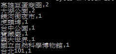

# 大台灣旅遊網熱門景點分析

本項目針對大台灣旅遊網站新聞資訊進行分析，找出內容中最常出現的景點次數，並透過 Apache sqoop 來與 Mysql 關聯式資料庫進行溝通相互傳遞資料

**注意事項**

* DistributedCache.addCacheFile(new URI("/user/ubuntu/viewpoint/part-m-00000"),job.getConfiguration()); //字串為HDFS上的景點資料 


# SQOOP使用教學


**軟體版本**

* hadoop : 2.6.0
* sqoop : 1.4.5


**腳本安裝**


**讀取 Local端 mysql 的所有表格**


information_schema ： Local 端 的database

root :  帳號

mysql ：密碼
```
/opt/sqoop/bin/sqoop list-tables --connect jdbc:mysql://127.0.0.1/information_schema --username root --password mysql
```


**mysql -> sqoop -> hdfs (Local端)**
 
 TABLES : Local 端 的database
 m 1  ： 限制 map 數量為 1 
 ```
 /opt/sqoop/bin/sqoop import --connect jdbc:mysql://127.0.0.1/information_schema --username root --password mysql --table TABLES -m 1 
 ``` 


      
      **mysql -> sqoop -> hdfs (對外IP)**


      首先需先給予 IP 資料庫權限

      ```
      mysql > create user '<user_name>'@'<ip>' identified by '<password>';

      mysql >  grant all on *.* to '<user_name>'@'<ip>';

      mysql >  flush privileges ;
      ```

      執行指令

      ```
      /opt/sqoop/bin/sqoop import --connect jdbc:mysql://<ip>/<database_name> --username <user_name> --password <password> --table <table_name> -m 1
      ```


      **hdfs -> sqoop -> mysql (Local端)**

      ```
      /opt/sqoop/bin/sqoop export --connect jdbc:mysql://127.0.0.1/mysql --username root --password mysql --table plugin --export-dir /user/hadoop/kind
      ```

      **Sqoop 字串包含查詢**

      ※ time 為資料庫時間欄位

      時間欄位包含 2015-04 
      ```
      sqoop import --connect jdbc:mysql://<ip>/<database> --username admin --password admin --table news  --where 'locate("2015-04",time)'>0
      ```

      只顯示時間欄位

      ```
      sqoop import --connect jdbc:mysql://<ip>/<database> --username admin --password admin --table news  
      --columns time --where 'locate("2015-04",time)'>0
      ```

      ```
      sqoop import --connect jdbc:mysql://<ip>/<database> --username admin --password admin --table news  --where 'locate("2015-10",time)'>0 -m 1
      ```

      年

      ```
      sqoop import --connect jdbc:mysql://<ip>/<database> --username admin --password admin --table news  --where 'locate(YEAR(NOW()),time)'> 0 -m 1
      ```
      月
      ```
      sqoop import --connect jdbc:mysql://<ip>/<database> --username admin --password admin --table news  --where 'locate(concat(YEAR(NOW()),"-",MONTH(NOW())),time)'> 0 -m 1
      ```
      歷年
      ```
      sqoop import --connect jdbc:mysql://<ip>/<database> --username admin --password admin --table news -m 1
      ```


      # 測試執行

      ###Hadoop

      news : Sqoop匯入的資料

      news_out : hadoop分析後的結果
      ```
      hadoop jar TraNews.jar com.imac.WordCount news news_out
      ```
      

      ###sqoop

      * 
       MySQL建立資料表
           
	   ```
	   mysql > create table test(name varchar(32) not null , value varchar(32) not null)
	   ```


	   * sqoop 匯出到MySQL


	   Sqoop 匯入 Mysql 中文亂碼 : 加入 ?useUnicode=true&characterEncoding=utf-8

	   ```
	   sqoop export --connect "jdbc:mysql://<ip>/<database>?useUnicode=true&characterEncoding=utf-8"  --username admin --password admin --table <table_name> --export-dir <HDFS檔案路徑> --columns name,value

	   ```

